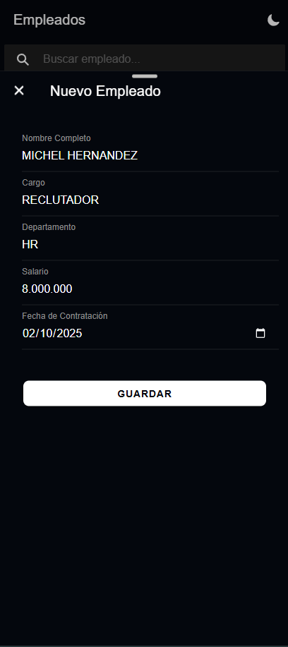
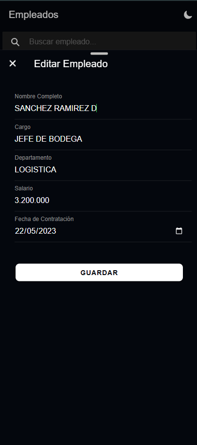
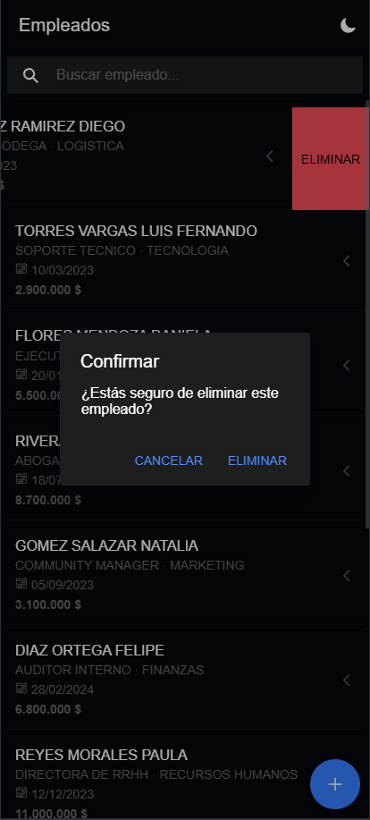
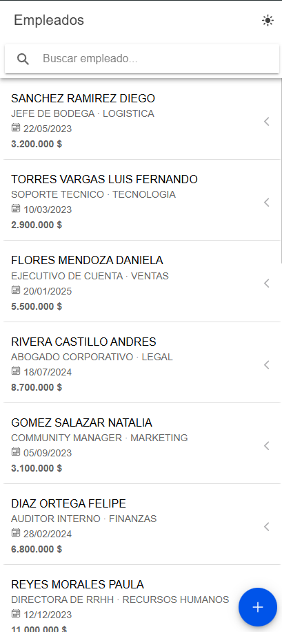
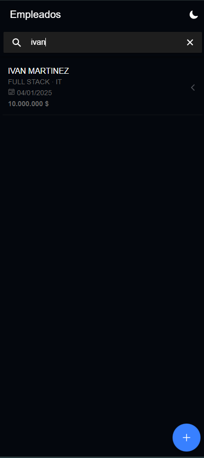

# 👔 HR Management App

<div align="center">


**Una solución moderna y eficiente para la gestión de empleados.**
Construida con los más altos estándares de desarrollo: **Clean Architecture**, **SOLID** y **Best Practices**.

[Reportar Bug](https://github.com/imartinezaguas/HHRR_APP_SOFTKA/issues) · [Solicitar Feature](https://github.com/imartinezaguas/HHRR_APP_SOFTKA/issues)

</div>

---

## 🚀 Características Principales

Esta aplicación no es solo un CRUD; es una demostración de ingeniería de software robusta.

*   💎 **Gestión Completa (CRUD)**:
    *   **Crear**: Validación de formularios en tiempo real (Reactive Forms).
    *   **Leer**: Listas optimizadas con **Infinite Scroll** y **Virtual Scroll**.
    *   **Actualizar**: Edición fluida con persistencia de datos.
    *   **Eliminar**: Interacción gestual moderna (**Swipe-to-delete**) con alertas de confirmación.
*   🔍 **Búsqueda Inteligente**: Filtrado instantáneo por ID o nombre.
*   🌗 **Dark Mode & Light Mode**: Detección automática y toggle manual para comodidad visual.
*   📱 **100% Responsivo**: Diseño adaptable que luce increíble en Móvil, Tablet y Escritorio.
*   ⚡ **Feedback de Usuario**: Uso de *Skeleton Loaders* para cargas y *Toast Notifications* para acciones.
*   🛡️ **Calidad Garantizada**: Cobertura de **Unit Tests > 80%** (Jasmine/Karma).

---

## � Galería Visual

Ve la aplicación en acción. Diseño limpio, moderno e intuitivo.

### � Gestión de Empleados

| Crear Nuevo Empleado | Editar Información | Eliminar (Swipe) |
|:---:|:---:|:---:|
|  |  |  |

### 📂 Listados y Búsqueda

| Listado Infinito | Búsqueda Instantánea |
|:---:|:---:|
|  |  |

---

## 🛠️ Stack Tecnológico

El proyecto está estructurado siguiendo **Clean Architecture**, dividiendo responsabilidades claramente:

1.  **Presentación (UI Layer)**: `src/app/presentation`
    *   Componentes Ionic/Angular.
    *   Lógica de vista y estado local.
2.  **Dominio (Domain Layer)**: `src/app/domain`
    *   Modelos (Entidades) puros.
    *   Interfaces de repositorios (Abstracciones).
    *   Casos de Uso (Lógica de negocio pura).
3.  **Infraestructura (Data Layer)**: `src/app/infrastructure`
    *   Implementación de repositorios.
    *   Llamadas HTTP y Mappers.

---

## 🔧 Instalación y Despliegue

Sigue estos pasos para correr el proyecto localmente:

1.  **Clonar el repositorio**
    ```bash
    git clone https://github.com/imartinezaguas/HHRR_APP_SOFTKA.git
    cd hr-app
    ```

2.  **Instalar dependencias**
    ```bash
    npm install
    ```

3. Configura el enviroment.ts con el puerto del API

4.  **Ejecutar servidor de desarrollo**
    ```bash
    ionic serve
    ```
    Visita `http://localhost:8100/` en tu navegador.

5.  **Ejecutar Pruebas Unitarias**
    Para verificar la calidad del código:
    ```bash
    npm test
    ```

---

<div align="center">

**Desarrollado con ❤️ para SOFTKA**

</div>
